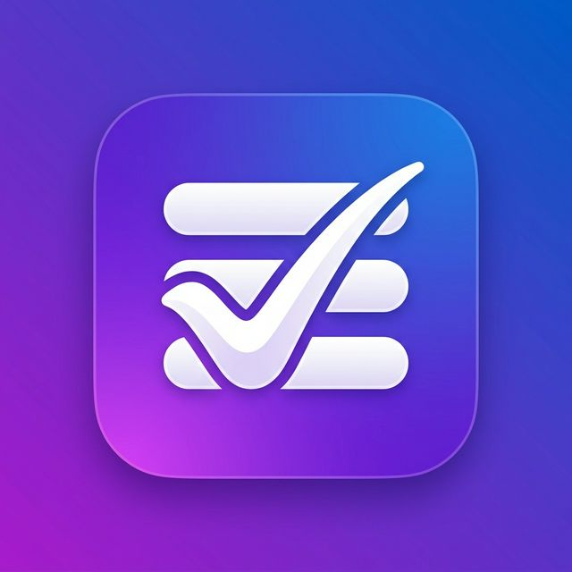

# To Do - Mobile App

A premium, feature-rich Todo List application built with **React Native** and **Expo**. This app uses **Supabase** for robust authentication and persistent task management, featuring advanced recurring tasks, custom reminders, and a monthly calendar view.



## 🚀 Features

-   **Authentication**: Secure login and registration powered by **Supabase Auth** with persistent session management.
-   **Task Management**: Comprehensive CRUD operations with support for Task Titles and **Multiline Descriptions**.
-   **Profile Settings**: Update your display name and change your password directly within the app.
-   **Advanced Recurring Tasks**: Set tasks to repeat **Daily**, **Weekly**, or **Monthly**. The app automatically spawns the next occurrence when the current one is completed.
-   **Smart Reminders**: Native background notifications that allow you to select both **Date and Time**.
-   **Calendar View**: A dedicated monthly calendar to browse tasks by their due dates.
-   **Sorting & Filtering**: Sort tasks by Date or Priority; filter by All, Pending, or Completed status with a polished, aligned UI.
-   **Dark Mode**: Full system-wide dark mode support that persists across app reloads.
-   **Native Experience**: Optimized for Android (APK) and iOS using Expo.

## 🛠️ Technology Stack

-   **Framework**: [React Native](https://reactnative.dev/) with [Expo SDK](https://expo.dev/)
-   **Navigation**: [React Navigation](https://reactnavigation.org/) (Stack & Bottom Tabs)
-   **State Management**: React Hooks (useState, useEffect, useCallback)
-   **API Client**: [Axios](https://axios-http.com/) with JWT interceptors
-   **Storage**: [expo-secure-store](https://docs.expo.dev/versions/latest/sdk/secure-store/)
-   **UI Components**: [react-native-calendars](https://github.com/wix/react-native-calendars), Ionicons
-   **Backend**: [Supabase](https://supabase.com/) (PostgreSQL & Go)
-   **Authentication**: Supabase Auth (GoTrue)

## 📲 Download the App

You can download the latest Android APK directly from the link below:

**[Download To Do APK (v1.1.1)](https://expo.dev/artifacts/eas/4HBcshFJxgLRfdbWU3rpwb.apk)**

## 📦 Installation & Setup

1. **Clone the repository**:
   ```bash
   git clone https://github.com/nishanthkumarbs/ToDo-Mobile-App.git
   cd ToDo-Mobile-App
   ```

2. **Install dependencies**:
   ```bash
   npm install
   ```

3. **Start the development server**:
   ```bash
   npx expo start
   ```
   *Scan the QR code with the Expo Go app on your phone.*

## 🏗️ Building the App (APK)

The project is configured for **EAS Build**. To generate a standalone Android APK:

```bash
npx eas-cli build -p android --profile preview
```

## 🌐 Backend Reference

The app is powered by **Supabase**.
Reference: `https://vynchejvskgtxiybttoc.supabase.co`

---
*Created by [Nishanth Kumar](https://github.com/nishanthkumarbs)*
